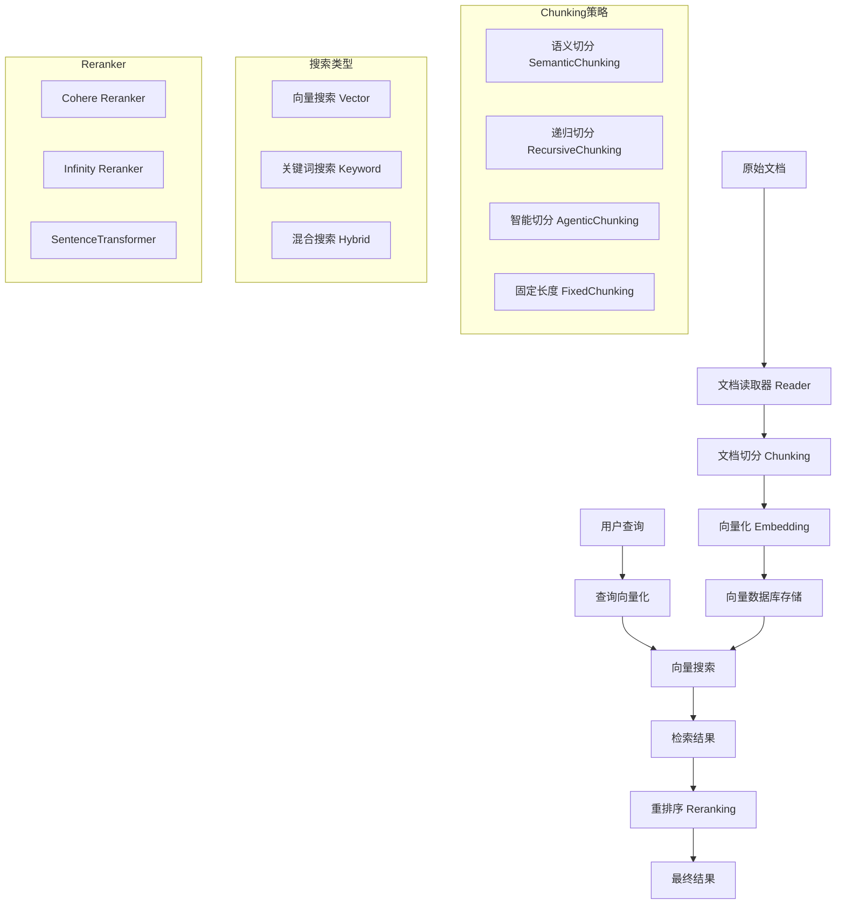
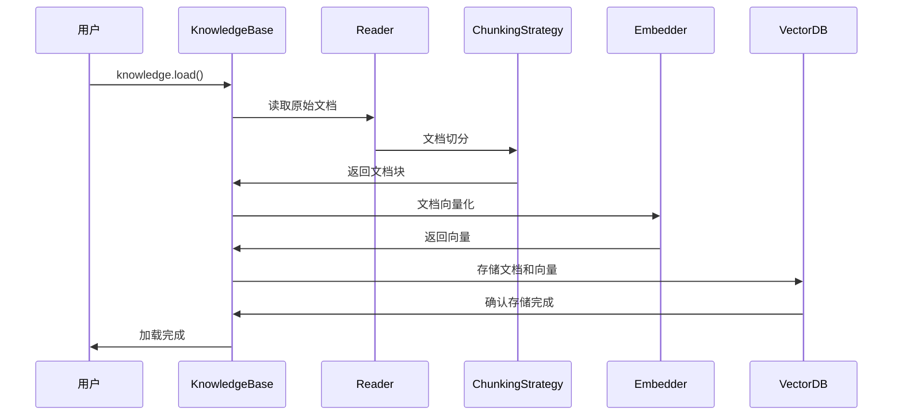
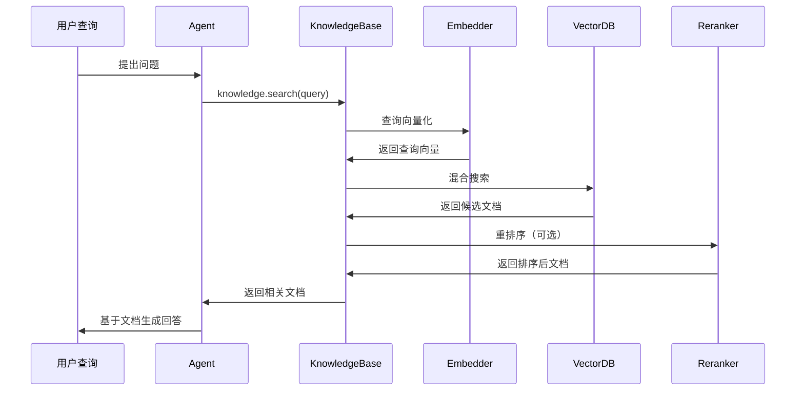

# Agno RAG技术栈深度分析

## 📋 概述

本文档深入分析 Agno 项目中 RAG（检索增强生成）技术栈的核心实现，包括文档切分（Chunking）、向量化（Embedding）、检索（Retrieval）、重排序（Reranking）等关键技术组件的设计思路和具体实现。

## 🔍 核心技术架构图



## 🧩 1. 文档切分（Chunking）技术栈

### 1.1 切分策略架构

Agno 实现了统一的切分策略接口，支持多种智能切分算法：

```python
# 基础切分策略抽象类
class ChunkingStrategy(ABC):
    @abstractmethod
    def chunk(self, document: Document) -> List[Document]:
        raise NotImplementedError
        
    def clean_text(self, text: str) -> str:
        # 统一的文本清理逻辑
        return re.sub(r"\n+", "\n", text)
```

### 1.2 语义切分（SemanticChunking）

**核心技术**：基于 embedding 相似度的语义边界检测

```python
class SemanticChunking(ChunkingStrategy):
    def __init__(
        self, 
        embedder: Optional[Embedder] = None, 
        chunk_size: int = 5000, 
        similarity_threshold: Optional[float] = 0.5
    ):
        self.embedder = embedder or OpenAIEmbedder(id="text-embedding-3-small")
        self.chunker = SemanticChunker(
            embedding_model=self.embedder.id,
            chunk_size=self.chunk_size,
            threshold=self.similarity_threshold,
        )
```

**技术特点**：
- 使用 `chonkie` 库进行语义分析
- 基于相似度阈值（默认0.5）确定切分点
- 保持语义连贯性，避免切断相关内容
- 自动添加 chunk 元数据（chunk编号、大小等）

### 1.3 递归切分（RecursiveChunking）

**核心技术**：智能寻找自然分隔符的递归切分算法

```python
class RecursiveChunking(ChunkingStrategy):
    def __init__(self, chunk_size: int = 5000, overlap: int = 0):
        self.chunk_size = chunk_size
        self.overlap = overlap  # 支持重叠以保持上下文
    
    def chunk(self, document: Document) -> List[Document]:
        # 寻找自然断点：\n, .
        for sep in ["\n", "."]:
            last_sep = content[start:end].rfind(sep)
            if last_sep != -1:
                end = start + last_sep + 1
                break
```

**技术优势**：
- 优先在换行符和句号处切分，保持语义完整性
- 支持重叠机制（overlap），提高检索召回率
- 智能防止无限循环，确保算法鲁棒性
- 重叠率超过15%时发出警告，平衡性能与效果

### 1.4 智能切分（AgenticChunking）

**核心技术**：使用 LLM 智能决定最佳切分点

```python
class AgenticChunking(ChunkingStrategy):
    def chunk(self, document: Document) -> List[Document]:
        prompt = f"""分析这段文本，在前{self.max_chunk_size}个字符内找到自然的断点。
        考虑语义完整性、段落边界和主题转换。
        只返回切分位置的字符数字：
        
        {remaining_text[:self.max_chunk_size]}"""
        
        response = self.model.response([Message(role="user", content=prompt)])
        break_point = min(int(response.content.strip()), self.max_chunk_size)
```

**创新特点**：
- 利用 LLM 的语言理解能力确定最佳切分点
- 考虑语义完整性、段落边界、主题转换
- 自动降级到固定长度作为 fallback
- 适用于复杂文档结构和多语言内容

## 🎯 2. 向量化（Embedding）技术栈

### 2.1 多提供商支持架构

Agno 支持 15+ 种 embedding 提供商，通过统一接口实现：

```python
@dataclass
class Embedder:
    dimensions: Optional[int] = 1536
    
    def get_embedding(self, text: str) -> List[float]:
        raise NotImplementedError
        
    def get_embedding_and_usage(self, text: str) -> Tuple[List[float], Optional[Dict]]:
        raise NotImplementedError
```

### 2.2 支持的 Embedding 提供商

| 提供商 | 模型示例 | 维度 | 特点 |
|--------|----------|------|------|
| **OpenAI** | text-embedding-3-small | 1536 | 高质量，支持批量处理 |
| **Cohere** | embed-multilingual-v3.0 | 1024 | 多语言支持 |
| **HuggingFace** | sentence-transformers | 768 | 开源模型，本地部署 |
| **Jina** | jina-embeddings-v2 | 768 | 长文本支持 |
| **Voyage AI** | voyage-large-2 | 1536 | 高精度检索 |
| **FastEmbed** | BAAI/bge-small-en | 384 | 快速推理 |

### 2.3 OpenAI Embedder 实现细节

```python
@dataclass
class OpenAIEmbedder(Embedder):
    id: str = "text-embedding-3-small"
    dimensions: Optional[int] = None
    encoding_format: Literal["float", "base64"] = "float"
    
    @property
    def _dimensions(self) -> int:
        if self.dimensions is not None:
            return self.dimensions
        return 3072 if self.id == "text-embedding-3-large" else 1536
```

**技术特点**：
- 自动检测模型维度（small: 1536, large: 3072）
- 支持多种编码格式
- 自动重试和错误处理
- 支持批量向量化以提高效率

## 🔍 3. 检索（Retrieval）技术栈

### 3.1 三种搜索模式

Agno 实现了全面的搜索策略，支持不同场景需求：

```python
class SearchType(str, Enum):
    vector = "vector"      # 纯向量语义搜索
    keyword = "keyword"    # 关键词精确匹配
    hybrid = "hybrid"      # 混合搜索
```

### 3.2 向量搜索（Vector Search）

**核心技术**：基于余弦相似度的稠密向量检索

```python
def _run_vector_search_sync(self, query: str, limit: int, filters: Dict) -> List[Document]:
    # 1. 查询向量化
    query_embedding = self.embedder.get_embedding(query)
    
    # 2. 向量相似度搜索
    results = self.client.search(
        collection_name=self.collection,
        query_vector=query_embedding,
        limit=limit,
        query_filter=filters
    )
    return results
```

**技术优势**：
- 语义理解能力强，能找到概念相关的内容
- 支持多语言检索
- 对同义词和相关概念有很好的召回率

### 3.3 关键词搜索（Keyword Search）

**核心技术**：基于稀疏向量的精确匹配

```python
def _run_keyword_search_sync(self, query: str, limit: int, filters: Dict) -> List[Document]:
    # 使用稀疏编码器生成关键词向量
    sparse_embedding = next(self.sparse_encoder.embed([query])).as_object()
    
    results = self.client.query_points(
        collection_name=self.collection,
        query=models.SparseVector(**sparse_embedding),
        limit=limit
    )
    return results
```

**适用场景**：
- 专业术语和专有名词检索
- 精确匹配需求
- 补充向量搜索的不足

### 3.4 混合搜索（Hybrid Search）

**核心技术**：结合稠密向量和稀疏向量的两阶段检索

```python
def _run_hybrid_search_sync(self, query: str, limit: int, filters: Dict) -> List[Document]:
    # 1. 生成稠密和稀疏向量
    dense_embedding = self.embedder.get_embedding(query)
    sparse_embedding = next(self.sparse_encoder.embed([query])).as_object()
    
    # 2. 两阶段检索
    call = self.client.query_points(
        collection_name=self.collection,
        prefetch=[
            # 第一阶段：稀疏向量检索
            models.Prefetch(
                query=models.SparseVector(**sparse_embedding),
                limit=limit,
                using=self.sparse_vector_name,
            ),
            # 第二阶段：稠密向量检索
            models.Prefetch(
                query=dense_embedding,
                limit=limit,
                using=self.dense_vector_name,
            )
        ],
        # 最终融合排序
        query=models.FusionQuery(fusion=models.Fusion.RRF),
        limit=limit
    )
    return call
```

**技术优势**：
- 结合语义理解和精确匹配
- RRF（Reciprocal Rank Fusion）融合算法
- 提高检索的准确率和召回率
- 适用于复杂查询场景

### 3.5 多向量数据库统一接口

```python
class VectorDb(ABC):
    @abstractmethod
    def search(self, query: str, limit: int = 5, filters: Optional[Dict[str, Any]] = None) -> List[Document]:
        raise NotImplementedError
    
    def vector_search(self, query: str, limit: int = 5) -> List[Document]:
        raise NotImplementedError
        
    def keyword_search(self, query: str, limit: int = 5) -> List[Document]:
        raise NotImplementedError
        
    def hybrid_search(self, query: str, limit: int = 5) -> List[Document]:
        raise NotImplementedError
```

**支持的向量数据库**：
- **高性能**：Qdrant、Milvus、Weaviate
- **云服务**：Pinecone、MongoDB Atlas Vector Search
- **集成式**：pgvector、ChromaDB、LanceDB
- **专业化**：SingleStore、ClickHouse、Cassandra

## 🚀 4. 重排序（Reranking）技术栈

### 4.1 Reranker 架构设计

```python
class Reranker(BaseModel):
    def rerank(self, query: str, documents: List[Document]) -> List[Document]:
        raise NotImplementedError
```

### 4.2 Cohere Reranker 实现

**核心技术**：使用 Cohere 的多语言重排序模型

```python
class CohereReranker(Reranker):
    model: str = "rerank-multilingual-v3.0"
    top_n: Optional[int] = None
    
    def _rerank(self, query: str, documents: List[Document]) -> List[Document]:
        # 1. 调用 Cohere API 进行重排序
        _docs = [doc.content for doc in documents]
        response = self.client.rerank(
            query=query, 
            documents=_docs, 
            model=self.model
        )
        
        # 2. 添加相关性分数
        compressed_docs = []
        for r in response.results:
            doc = documents[r.index]
            doc.reranking_score = r.relevance_score
            compressed_docs.append(doc)
        
        # 3. 按相关性分数排序
        compressed_docs.sort(
            key=lambda x: x.reranking_score or float("-inf"),
            reverse=True
        )
        
        return compressed_docs[:self.top_n] if self.top_n else compressed_docs
```

**技术特点**：
- 支持 100+ 种语言的重排序
- 基于查询-文档相关性的精确评分
- 自动容错，失败时返回原始结果
- 支持 top_n 参数控制返回数量

### 4.3 其他 Reranker 实现

#### Infinity Reranker
```python
class InfinityReranker(Reranker):
    # 支持本地部署的开源重排序模型
    model_name: str = "BAAI/bge-reranker-base"
    host: str = "localhost"
    port: int = 8080
```

#### SentenceTransformer Reranker
```python  
class SentenceTransformerReranker(Reranker):
    # 基于 Sentence-BERT 的重排序
    model_name: str = "cross-encoder/ms-marco-MiniLM-L-6-v2"
    device: str = "cpu"
```

### 4.4 重排序策略对比

| Reranker | 优势 | 适用场景 | 性能 |
|----------|------|----------|------|
| **Cohere** | 多语言支持，云端API | 生产环境，多语言应用 | 高精度 |
| **Infinity** | 本地部署，隐私保护 | 私有化部署，成本控制 | 中等 |
| **SentenceTransformer** | 开源免费，可定制 | 研究开发，特定域优化 | 可调节 |

## 🔧 5. 知识库（Knowledge）整合架构

### 5.1 AgentKnowledge 核心架构

```python
class AgentKnowledge(BaseModel):
    # 组件配置
    reader: Optional[Reader] = None                    # 文档读取器
    vector_db: Optional[VectorDb] = None              # 向量数据库
    chunking_strategy: ChunkingStrategy = FixedSizeChunking()  # 切分策略
    
    # 检索参数
    num_documents: int = 5                            # 返回文档数量
    optimize_on: Optional[int] = 1000                 # 优化阈值
    
    def search(self, query: str, num_documents: Optional[int] = None, 
               filters: Optional[Dict[str, Any]] = None) -> List[Document]:
        """统一的搜索接口"""
        return self.vector_db.search(query=query, limit=num_documents or self.num_documents, filters=filters)
```

### 5.2 知识库加载流程

```python
def load(self, recreate: bool = False, upsert: bool = False, skip_existing: bool = True) -> None:
    """完整的知识库加载流程"""
    
    # 1. 数据库初始化
    if recreate:
        self.vector_db.drop()
    if not self.vector_db.exists():
        self.vector_db.create()
    
    # 2. 文档处理和加载
    for document_list in self.document_lists:
        # 2.1 元数据跟踪
        for doc in document_list:
            if doc.meta_data:
                self._track_metadata_structure(doc.meta_data)
        
        # 2.2 根据策略选择插入方式
        if upsert and self.vector_db.upsert_available():
            # Upsert 模式（更新或插入）
            for doc in document_list:
                self.vector_db.upsert(documents=[doc], filters=doc.meta_data)
        else:
            # Insert 模式
            if skip_existing:
                documents_to_load = self.filter_existing_documents(document_list)
            else:
                documents_to_load = document_list
                
            for doc in documents_to_load:
                self.vector_db.insert(documents=[doc], filters=doc.meta_data)
```

### 5.3 支持的知识库类型

| 知识库类型 | 数据源 | Reader | 特点 |
|------------|--------|---------|------|
| **UrlKnowledge** | 网页内容 | UrlReader | 自动网页解析，支持多URL |
| **PDFKnowledge** | PDF文档 | PdfReader | 支持本地/云端PDF |
| **DocxKnowledge** | Word文档 | DocxReader | 支持复杂格式文档 |
| **YouTubeKnowledge** | 视频内容 | YouTubeReader | 自动字幕提取 |
| **ArxivKnowledge** | 学术论文 | ArxivReader | 科研文献专用 |
| **CombinedKnowledge** | 混合数据源 | 多Reader | 支持多种数据源整合 |

### 5.4 智能元数据管理

```python
def _track_metadata_structure(self, metadata: Dict[str, Any]) -> None:
    """自动跟踪元数据结构用于过滤功能"""
    if self.valid_metadata_filters is None:
        self.valid_metadata_filters = set()
    
    for key in metadata.keys():
        self.valid_metadata_filters.add(key)

def filter_existing_documents(self, documents: List[Document]) -> List[Document]:
    """过滤已存在的文档，避免重复插入"""
    return [doc for doc in documents if not self.vector_db.doc_exists(doc)]
```

## 🎯 6. 完整 RAG 工作流程

### 6.1 索引阶段（Indexing Phase）



### 6.2 检索阶段（Retrieval Phase）



## 🔍 6. 查询处理（Query Processing）技术栈

### 6.1 智能查询路由与过滤

Agno 实现了先进的查询处理机制，支持动态查询理解、智能过滤和上下文增强。

#### 6.1.1 查询验证与过滤系统

```python
def get_relevant_docs_from_knowledge(
    self, query: str, num_documents: Optional[int] = None, 
    filters: Optional[Dict[str, Any]] = None, **kwargs
) -> Optional[List[Union[Dict[str, Any], str]]]:
    """获取相关文档，支持智能过滤和验证"""
    
    # 1. 过滤器验证
    if self.knowledge is not None:
        valid_filters, invalid_keys = self.knowledge.validate_filters(filters)
        
        # 警告无效的过滤键
        if invalid_keys:
            log_warning(f"Invalid filter keys: {invalid_keys}")
            log_info(f"Valid filter keys: {self.knowledge.valid_metadata_filters}")
    
    # 2. 执行知识库搜索
    relevant_docs = self.knowledge.search(
        query=query, num_documents=num_documents, filters=filters
    )
    
    return [doc.to_dict() for doc in relevant_docs]
```

#### 6.1.2 Agentic 查询过滤

**核心创新**：让 AI Agent 自动决定查询过滤条件

```python
def search_knowledge_base_with_agentic_filters_function(self) -> Function:
    """工厂函数：创建支持智能过滤的搜索函数"""
    
    def search_knowledge_base(query: str, filters: Optional[Dict[str, Any]] = None) -> str:
        """使用此函数搜索知识库，支持智能过滤
        
        Args:
            query: 搜索查询
            filters: 过滤条件字典，AI 可以自动推断和设置
        """
        # 智能合并用户过滤器和 Agent 推断的过滤器
        search_filters = self._get_agentic_or_user_search_filters(filters, knowledge_filters)
        
        # 执行搜索并记录性能指标
        retrieval_timer = Timer()
        retrieval_timer.start()
        docs_from_knowledge = self.get_relevant_docs_from_knowledge(
            query=query, filters=search_filters
        )
        retrieval_timer.stop()
        
        return self.convert_documents_to_string(docs_from_knowledge)
```

**智能过滤优势**：
- AI 根据查询内容自动推断合适的过滤条件
- 支持多层级过滤器合并（用户级 + Agent级 + 动态推断）
- 自动验证过滤器有效性，防止无效查询

### 6.2 查询扩展与增强

#### 6.2.1 上下文感知查询处理

```python
# Agent 可以在工具调用中访问完整的上下文信息
def search_knowledge_base(query: str) -> str:
    """上下文感知的知识库搜索"""
    
    # 1. 自动添加上下文信息到查询中
    if self.add_context:
        # 将会话状态、用户信息等添加到查询上下文
        enhanced_query = self._enhance_query_with_context(query)
    
    # 2. 基于对话历史优化查询
    if self.add_history_to_messages:
        # 利用历史对话理解查询意图
        query = self._refine_query_with_history(query)
    
    # 3. 执行增强后的搜索
    docs_from_knowledge = self.get_relevant_docs_from_knowledge(query=enhanced_query)
```

#### 6.2.2 多模态查询支持

```python
# 支持文本、图片、音频等多模态查询
class MultimodalQueryProcessor:
    def process_query(self, query: Union[str, Message]) -> str:
        """处理多模态查询输入"""
        if isinstance(query, Message):
            # 处理包含图片、音频的复合查询
            text_query = query.content
            if query.images:
                text_query += self._process_image_context(query.images)
            if query.audio:
                text_query += self._process_audio_context(query.audio)
        
        return self._execute_enhanced_search(text_query)
```

### 6.3 查询性能监控

#### 6.3.1 实时性能追踪

```python
# 每次查询都会记录详细的性能指标
def search_with_metrics(query: str) -> str:
    """带性能监控的搜索"""
    retrieval_timer = Timer()
    retrieval_timer.start()
    
    # 执行搜索
    docs_from_knowledge = self.get_relevant_docs_from_knowledge(query=query)
    
    # 记录性能指标
    retrieval_timer.stop()
    
    # 添加引用信息到响应中
    if docs_from_knowledge:
        references = MessageReferences(
            query=query, 
            references=docs_from_knowledge, 
            time=round(retrieval_timer.elapsed, 4)  # 记录检索时间
        )
        self.run_response.extra_data.references.append(references)
    
    log_debug(f"检索耗时: {retrieval_timer.elapsed:.4f}s")
    return self.convert_documents_to_string(docs_from_knowledge)
```

## 🎯 7. 上下文管理（Context Management）技术栈

### 7.1 多层次状态管理架构

Agno 实现了业界最先进的多层次上下文管理系统，支持动态上下文注入和智能状态合并。

#### 7.1.1 状态层次结构

```python
def format_message_with_state_variables(self, message: str) -> str:
    """使用多层次状态变量格式化消息"""
    
    # 构建优先级状态链（ChainMap 自动处理优先级）
    format_variables = ChainMap(
        self.session_state or {},           # 会话状态（最高优先级）
        self.team_session_state or {},      # 团队会话状态
        self.workflow_session_state or {},  # 工作流状态
        self.context or {},                 # 动态上下文
        self.extra_data or {},              # 额外数据
        {"user_id": self.user_id} if self.user_id else {},  # 用户信息
    )
    
    # 安全的模板替换
    template = string.Template(message)
    try:
        return template.safe_substitute(format_variables)
    except Exception as e:
        log_warning(f"模板替换失败: {e}")
        return message
```

**多层次状态说明**：

| 状态层级 | 作用域 | 持久性 | 用途 |
|----------|--------|--------|------|
| **session_state** | 单次会话 | 短期 | 会话内的临时状态和变量 |
| **team_session_state** | 团队协作 | 中期 | 多Agent协作时的共享状态 |
| **workflow_session_state** | 工作流 | 长期 | 跨步骤的工作流状态管理 |
| **context** | 运行时 | 动态 | 实时计算的上下文数据 |
| **extra_data** | 自定义 | 可配置 | 用户自定义的额外数据 |
| **user_id** | 用户级 | 持久 | 用户身份和个性化信息 |

### 7.2 动态上下文解析

#### 7.2.1 智能函数解析机制

```python
def resolve_run_context(self) -> None:
    """解析运行时上下文（同步版本）"""
    
    if not isinstance(self.context, dict):
        return
    
    for key, value in self.context.items():
        if not callable(value):
            # 静态值直接使用
            self.context[key] = value
            continue
        
        try:
            # 检查函数签名，支持依赖注入
            sig = signature(value)
            if "agent" in sig.parameters:
                # 函数需要 agent 参数，注入当前 agent 实例
                result = value(agent=self)
            else:
                # 普通函数调用
                result = value()
            
            # 更新上下文
            self.context[key] = result
            
        except Exception as e:
            log_warning(f"解析上下文 '{key}' 失败: {e}")
```

#### 7.2.2 异步上下文支持

```python
async def aresolve_run_context(self) -> None:
    """异步解析运行时上下文"""
    
    for key, value in self.context.items():
        if callable(value):
            try:
                result = value(agent=self) if "agent" in signature(value).parameters else value()
                
                # 支持协程函数
                if iscoroutine(result):
                    result = await result
                
                self.context[key] = result
                
            except Exception as e:
                log_warning(f"异步解析上下文 '{key}' 失败: {e}")
```

### 7.3 上下文注入策略

#### 7.3.1 三种注入模式

**模式一：add_context=True（完整上下文注入）**
```python
agent = Agent(
    context={"current_weather": get_weather_data},
    add_context=True,  # 将整个 context 字典添加到用户消息
    model=OpenAIChat()
)
# 结果：用户消息会包含完整的上下文数据
```

**模式二：add_state_in_messages=True（模板化注入）**
```python
agent = Agent(
    context={"stock_prices": get_stock_data},
    instructions="当前股价信息：{stock_prices}",  # 使用模板语法
    add_state_in_messages=True,  # 启用模板变量替换
    model=OpenAIChat()
)
# 结果：instructions 中的 {stock_prices} 会被替换为实际数据
```

**模式三：手动上下文管理**
```python
def custom_context_handler(agent):
    # 自定义上下文处理逻辑
    weather = get_weather()
    news = get_latest_news()
    return f"天气：{weather}\n新闻：{news}"

agent = Agent(
    context={"environment_info": custom_context_handler},
    resolve_context=True,  # 启用上下文解析
    model=OpenAIChat()
)
```

### 7.4 长期记忆集成

#### 7.4.1 记忆系统架构

```python
class AgentMemoryIntegration:
    """Agent 记忆系统集成"""
    
    def __init__(self):
        self.memory: Optional[AgentMemory] = None
        self.enable_agentic_memory: bool = False      # 智能记忆管理
        self.enable_user_memories: bool = False       # 用户记忆
        self.enable_session_summaries: bool = False   # 会话摘要
        
    def get_context_with_memory(self, query: str) -> Dict[str, Any]:
        """获取包含记忆的上下文"""
        context = {}
        
        # 1. 添加相关记忆
        if self.memory and self.enable_user_memories:
            relevant_memories = self.memory.search_memories(query)
            context["relevant_memories"] = relevant_memories
        
        # 2. 添加会话摘要
        if self.enable_session_summaries:
            session_summary = self.get_session_summary()
            context["session_context"] = session_summary
        
        # 3. 合并动态上下文
        if self.context:
            context.update(self.resolve_context())
        
        return context
```

#### 7.4.2 智能记忆管理

```python
# Agentic Memory: AI 自动决定什么值得记住
class AgenticMemoryManager:
    def auto_create_memories(self, interaction_data: Dict) -> None:
        """AI 自动创建有价值的记忆"""
        
        # 1. 让 AI 分析对话，提取关键信息
        memory_extraction_prompt = f"""
        分析以下对话，提取值得长期记住的关键信息：
        
        对话内容：{interaction_data}
        
        请提取：
        1. 用户偏好和习惯
        2. 重要的事实和数据
        3. 未完成的任务
        4. 重要的上下文信息
        """
        
        # 2. 使用专门的记忆模型处理
        extracted_memories = self.memory_model.extract_memories(memory_extraction_prompt)
        
        # 3. 自动存储到记忆系统
        for memory in extracted_memories:
            self.memory.create_memory(
                user_id=self.user_id,
                content=memory.content,
                importance=memory.importance_score
            )
```

### 7.5 上下文压缩与优化

#### 7.5.1 智能上下文裁剪

```python
class ContextOptimizer:
    """上下文优化器"""
    
    def optimize_context_length(self, context: str, max_tokens: int) -> str:
        """智能压缩上下文长度"""
        
        if self.estimate_tokens(context) <= max_tokens:
            return context
        
        # 1. 按重要性排序内容块
        content_blocks = self.split_into_blocks(context)
        scored_blocks = self.score_importance(content_blocks)
        
        # 2. 保留最重要的内容
        selected_blocks = []
        current_tokens = 0
        
        for block in sorted(scored_blocks, key=lambda x: x.importance, reverse=True):
            block_tokens = self.estimate_tokens(block.content)
            if current_tokens + block_tokens <= max_tokens:
                selected_blocks.append(block)
                current_tokens += block_tokens
        
        # 3. 重新排序并合并
        selected_blocks.sort(key=lambda x: x.original_order)
        return "\n\n".join(block.content for block in selected_blocks)
```

#### 7.5.2 上下文缓存策略

```python
class ContextCache:
    """上下文缓存管理"""
    
    def __init__(self):
        self.context_cache = {}
        self.cache_ttl = 300  # 5分钟缓存
    
    def get_cached_context(self, context_key: str) -> Optional[str]:
        """获取缓存的上下文"""
        if context_key in self.context_cache:
            cached_data = self.context_cache[context_key]
            if time.time() - cached_data['timestamp'] < self.cache_ttl:
                return cached_data['content']
        
        return None
    
    def cache_context(self, context_key: str, content: str) -> None:
        """缓存上下文内容"""
        self.context_cache[context_key] = {
            'content': content,
            'timestamp': time.time()
        }
```

### 7.6 上下文一致性保障

#### 7.6.1 跨会话上下文同步

```python
class CrossSessionContextManager:
    """跨会话上下文管理器"""
    
    def sync_context_across_sessions(self, user_id: str) -> Dict[str, Any]:
        """同步用户的跨会话上下文"""
        
        # 1. 获取用户的长期偏好
        user_preferences = self.storage.get_user_preferences(user_id)
        
        # 2. 获取最近的会话摘要
        recent_summaries = self.storage.get_recent_session_summaries(user_id, limit=5)
        
        # 3. 合并为统一的用户上下文
        unified_context = {
            "user_preferences": user_preferences,
            "recent_interactions": recent_summaries,
            "persistent_state": self.storage.get_user_persistent_state(user_id)
        }
        
        return unified_context
```

### 7.7 上下文安全与隐私

#### 7.7.1 敏感信息过滤

```python
class ContextSecurityFilter:
    """上下文安全过滤器"""
    
    def filter_sensitive_context(self, context: Dict[str, Any]) -> Dict[str, Any]:
        """过滤敏感信息"""
        
        sensitive_patterns = [
            r'\b\d{4}\s?\d{4}\s?\d{4}\s?\d{4}\b',  # 信用卡号
            r'\b\d{3}-\d{2}-\d{4}\b',              # 社会安全号码
            r'\b[A-Za-z0-9._%+-]+@[A-Za-z0-9.-]+\.[A-Z|a-z]{2,}\b'  # 邮箱
        ]
        
        filtered_context = {}
        for key, value in context.items():
            if isinstance(value, str):
                filtered_value = value
                for pattern in sensitive_patterns:
                    filtered_value = re.sub(pattern, '[REDACTED]', filtered_value)
                filtered_context[key] = filtered_value
            else:
                filtered_context[key] = value
        
        return filtered_context
```

## 📊 8. 性能优化策略

### 8.1 索引优化

```python
class AgentKnowledge:
    optimize_on: Optional[int] = 1000  # 达到1000文档时优化
    
    def load(self):
        # 批量插入优化
        if len(documents_to_load) > 100:
            self.vector_db.batch_insert(documents_to_load)
        
        # 定期优化索引
        if num_documents % self.optimize_on == 0:
            self.vector_db.optimize()
```

### 7.2 缓存策略

- **向量缓存**：相同文档的向量计算结果缓存
- **搜索缓存**：常见查询的结果缓存
- **元数据缓存**：文档元数据的内存缓存

### 7.3 并发处理

```python
async def aload(self):
    """异步并发加载，提高处理速度"""
    tasks = []
    async for document_list in self.async_document_lists:
        tasks.append(self._process_documents_async(document_list))
    
    await asyncio.gather(*tasks)
```

## 🔮 9. 高级特性

### 8.1 多模态支持

```python
# 支持图片、音频等多模态内容
class MultimodalKnowledge(AgentKnowledge):
    image_embedder: Optional[ImageEmbedder] = None
    audio_embedder: Optional[AudioEmbedder] = None
```

### 8.2 实时更新

```python
# 支持知识库的实时更新
def update_document(self, document: Document):
    if self.vector_db.upsert_available():
        self.vector_db.upsert([document])
    else:
        self.vector_db.delete_by_id(document.id)
        self.vector_db.insert([document])
```

### 8.3 分布式处理

- 支持分布式向量数据库（Milvus、Qdrant集群）
- 支持分片存储和并行检索
- 支持跨数据中心的数据同步

## 📈 10. 性能基准测试

### 9.1 切分性能对比

| 切分策略 | 处理速度 | 内存占用 | 切分质量 | 适用场景 |
|----------|----------|----------|----------|----------|
| **Fixed** | 极快 | 低 | 一般 | 简单文档，快速原型 |
| **Recursive** | 快 | 低 | 好 | 通用场景 |
| **Semantic** | 中等 | 中等 | 很好 | 需要语义完整性 |
| **Agentic** | 较慢 | 高 | 最好 | 复杂文档，高质量要求 |

### 9.2 检索性能对比

| 搜索类型 | 延迟 | 准确率 | 召回率 | 资源消耗 |
|----------|------|--------|--------|----------|
| **Vector** | 低 | 85% | 90% | 中等 |
| **Keyword** | 极低 | 95% | 70% | 低 |
| **Hybrid** | 中等 | 90% | 95% | 高 |

## 🎯 11. 最佳实践建议

### 10.1 切分策略选择

```python
# 根据文档类型选择切分策略
def get_optimal_chunking_strategy(doc_type: str) -> ChunkingStrategy:
    if doc_type == "academic_paper":
        return SemanticChunking(similarity_threshold=0.3)
    elif doc_type == "technical_doc":
        return RecursiveChunking(chunk_size=3000, overlap=300)
    elif doc_type == "creative_writing":
        return AgenticChunking(max_chunk_size=4000)
    else:
        return FixedSizeChunking(chunk_size=1500)
```

### 10.2 搜索策略优化

```python
# 自适应搜索策略
def adaptive_search(query: str, query_type: str) -> List[Document]:
    if "exact phrase" in query or query_type == "factual":
        return knowledge.vector_db.keyword_search(query)
    elif query_type == "conceptual":
        return knowledge.vector_db.vector_search(query)
    else:
        return knowledge.vector_db.hybrid_search(query)
```

### 10.3 重排序配置

```python
# 根据应用场景配置重排序
production_config = {
    "reranker": CohereReranker(model="rerank-multilingual-v3.0", top_n=5),
    "fallback_search_limit": 20  # 检索20个候选，重排序后返回5个
}

development_config = {
    "reranker": SentenceTransformerReranker(model="cross-encoder/ms-marco-MiniLM-L-6-v2"),
    "fallback_search_limit": 10
}
```

## 🏁 12. 总结

Agno 的 RAG 技术栈展现了现代检索增强生成系统的最佳实践：

### 核心优势

1. **模块化设计**：每个组件都可以独立配置和替换
2. **算法丰富**：提供多种切分、embedding、搜索、重排序策略
3. **性能优化**：支持异步处理、批量操作、索引优化
4. **扩展性强**：支持自定义实现和第三方集成
5. **生产就绪**：完整的错误处理、监控和容错机制

### 技术创新点

1. **Agentic Chunking**：使用LLM智能决定切分点
2. **混合搜索**：结合稠密和稀疏向量的两阶段检索
3. **多模态支持**：统一接口处理文本、图片、音频
4. **智能元数据**：自动跟踪和利用文档元数据
5. **Agentic查询过滤**：AI自动推断查询过滤条件
6. **多层次上下文管理**：六层状态管理系统
7. **动态上下文解析**：支持函数依赖注入和异步处理
8. **智能记忆集成**：AI自动决定记忆价值

### 架构优势

- **插件化**：15种向量数据库 × 多种embedding × 多种切分策略 = 极高的灵活性
- **智能化**：从切分到检索到重排序的全链路AI优化
- **可扩展**：支持从单机到分布式的无缝扩展
- **易用性**：统一接口，简单配置即可使用

Agno 的 RAG 技术栈不仅仅是一个检索系统，更是一个完整的智能知识处理和理解平台，集成了先进的查询处理、上下文管理、长期记忆等技术，为构建智能AI应用提供了坚实的技术基础。

### 完整技术栈覆盖

- **文档处理层**：多策略切分、语义理解、智能清理
- **向量化层**：15+种embedding提供商、统一接口管理
- **存储层**：15种向量数据库、混合搜索支持
- **检索层**：语义搜索、关键词匹配、混合检索
- **重排序层**：多种reranker、相关性优化
- **查询处理层**：智能过滤、上下文增强、性能监控
- **上下文管理层**：多层次状态、动态解析、记忆集成
- **应用层**：Agent集成、工具化封装、易用接口

这个全栈式的技术架构使得Agno能够适应从简单问答到复杂推理的各种AI应用场景。