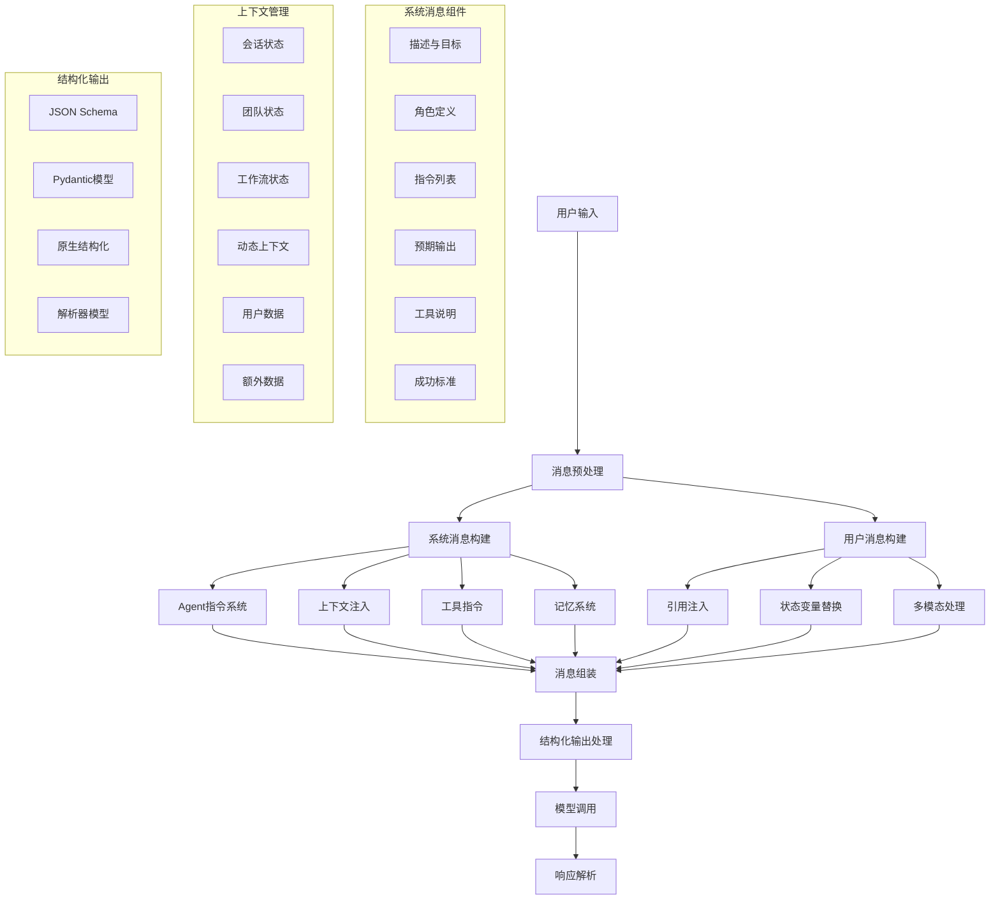

# Agno 提示词工程深度分析

## 📋 概述

本文档深入分析 Agno 项目中提示词工程（Prompt Engineering）技术的核心实现，包括系统消息构建、用户消息处理、上下文注入、状态管理、结构化输出等关键技术组件的设计思路和具体实现。

## 🔍 核心技术架构图



## 🧩 1. 系统消息构建技术栈

### 1.1 系统消息架构

Agno 实现了高度模块化的系统消息构建系统，支持动态组装和智能优化：

```python
def get_system_message(self, session_id: str, user_id: Optional[str] = None) -> Optional[Message]:
    """构建完整的系统消息"""
    
    # 1. 处理自定义系统消息
    if self.system_message is not None:
        if callable(self.system_message):
            system_message_kwargs = {"agent": self, "session_id": session_id, "user_id": user_id}
            return self.system_message(**system_message_kwargs)
        elif isinstance(self.system_message, Message):
            return self.system_message
        else:
            return Message(role=self.system_message_role, content=self.system_message)
    
    # 2. 构建默认系统消息
    if not self.create_default_system_message:
        return None
    
    # 3. 多组件系统消息构建
    return self._build_comprehensive_system_message(session_id, user_id)
```

### 1.2 多层次指令系统

**核心技术**：分层次、结构化的指令组织系统

```python
def _build_comprehensive_system_message(self, session_id: str, user_id: Optional[str] = None) -> Message:
    """构建全面的系统消息"""
    system_message_content = ""
    
    # 3.1 Agent描述和基础信息
    if self.description is not None:
        system_message_content += f"{self.description.strip()}\n\n"
    
    # 3.2 处理指令列表
    instructions = []
    if isinstance(self.instructions, str):
        instructions.append(self.instructions)
    elif isinstance(self.instructions, list):
        instructions.extend(self.instructions)
    elif callable(self.instructions):
        dynamic_instructions = self.instructions(agent=self)
        if isinstance(dynamic_instructions, str):
            instructions.append(dynamic_instructions)
        elif isinstance(dynamic_instructions, list):
            instructions.extend(dynamic_instructions)
    
    # 3.3 添加时间和位置信息
    if self.add_datetime_to_instructions:
        from datetime import datetime
        instructions.append(f"The current time is: {datetime.now()}")
    
    if self.add_location_to_instructions:
        location_info = self._get_location_info()
        if location_info:
            instructions.append(f"Your location context: {location_info}")
    
    # 3.4 构建目标和角色
    if self.goal is not None:
        system_message_content += f"\n<your_goal>\n{self.goal}\n</your_goal>\n\n"
    
    if self.role is not None:
        system_message_content += f"\n<your_role>\n{self.role}\n</your_role>\n\n"
    
    # 3.5 团队协作指令
    if self.has_team and self.add_transfer_instructions:
        system_message_content += self._get_team_instructions()
    
    # 3.6 核心指令组装
    if len(instructions) > 0:
        system_message_content += "<instructions>"
        if len(instructions) > 1:
            for _upi in instructions:
                system_message_content += f"\n- {_upi}"
        else:
            system_message_content += "\n" + instructions[0]
        system_message_content += "\n</instructions>\n\n"
    
    return Message(role=self.system_message_role, content=system_message_content.strip())
```

**技术特点**：
- **动态指令生成**：支持函数式指令，运行时动态生成
- **分层结构化**：goal, role, instructions 分层组织
- **上下文感知**：自动添加时间、位置等上下文信息
- **团队协作**：自动生成团队任务分配指令

### 1.3 工具指令自动集成

**核心技术**：智能工具指令生成和集成

```python
def determine_tools_for_model(self, model: Model, session_id: str, user_id: Optional[str] = None) -> None:
    """确定模型可用工具并生成指令"""
    
    if self._rebuild_tools:
        self._tool_instructions = []
        
        for tool in agent_tools:
            if isinstance(tool, Toolkit):
                # 从工具包添加指令
                if tool.add_instructions and tool.instructions is not None:
                    self._tool_instructions.append(tool.instructions)
            
            elif isinstance(tool, Function):
                # 从函数添加指令
                if tool.add_instructions and tool.instructions is not None:
                    self._tool_instructions.append(tool.instructions)
    
    # 工具指令自动注入到系统消息
    if self._tool_instructions is not None:
        for _ti in self._tool_instructions:
            system_message_content += f"{_ti}\n"
```

### 1.4 记忆系统集成

**核心技术**：多类型记忆系统的提示词集成

```python
# 用户记忆集成
if isinstance(self.memory, Memory) and self.add_memory_references:
    user_memories = self.memory.get_user_memories(user_id=user_id)
    if user_memories and len(user_memories) > 0:
        system_message_content += (
            "You have access to memories from previous interactions with the user:\n\n"
        )
        system_message_content += "<memories_from_previous_interactions>"
        for _memory in user_memories:
            system_message_content += f"\n- {_memory.memory}"
        system_message_content += "\n</memories_from_previous_interactions>\n\n"

# 智能记忆管理指令
if self.enable_agentic_memory:
    system_message_content += (
        "\n<updating_user_memories>\n"
        "- You have access to the `update_user_memory` tool\n"
        "- If the user's message includes information that should be captured as a memory, use this tool\n"
        "- Memories should include details that could personalize ongoing interactions\n"
        "</updating_user_memories>\n\n"
    )
```

## 🎯 2. 用户消息处理技术栈

### 2.1 多模式消息构建

**核心技术**：支持多种输入模式的统一消息处理

```python
def get_user_message(
    self, 
    *, 
    message: Optional[Union[str, List, Dict, Message, BaseModel]] = None,
    audio: Optional[Sequence[Audio]] = None,
    images: Optional[Sequence[Image]] = None,
    videos: Optional[Sequence[Video]] = None,
    files: Optional[Sequence[File]] = None,
    knowledge_filters: Optional[Dict[str, Any]] = None,
    **kwargs: Any,
) -> Optional[Message]:
    """构建用户消息"""
    
    # 1. 自定义用户消息处理
    if self.user_message is not None:
        if callable(self.user_message):
            user_message_kwargs = {
                "agent": self, 
                "message": message, 
                "references": references
            }
            user_message_content = self.user_message(**user_message_kwargs)
        
        # 状态变量替换
        if self.add_state_in_messages:
            user_message_content = self.format_message_with_state_variables(user_message_content)
        
        return Message(
            role=self.user_message_role,
            content=user_message_content,
            audio=audio, images=images, videos=videos, files=files,
            **kwargs,
        )
    
    # 2. 默认用户消息构建
    return self._build_default_user_message(message, audio, images, videos, files, **kwargs)
```

### 2.2 引用系统集成

**核心技术**：知识库引用的智能注入

```python
def _build_user_message_with_references(self, message_str: str, knowledge_filters: Dict) -> str:
    """构建包含引用的用户消息"""
    
    # 1. 从知识库获取引用
    retrieval_timer = Timer()
    retrieval_timer.start()
    
    docs_from_knowledge = self.get_relevant_docs_from_knowledge(
        query=message_str, filters=knowledge_filters
    )
    
    if docs_from_knowledge is not None:
        references = MessageReferences(
            query=message_str, 
            references=docs_from_knowledge, 
            time=round(retrieval_timer.elapsed, 4)
        )
        
        # 2. 添加引用到运行响应
        if self.run_response.extra_data is None:
            self.run_response.extra_data = RunResponseExtraData()
        if self.run_response.extra_data.references is None:
            self.run_response.extra_data.references = []
        self.run_response.extra_data.references.append(references)
    
    retrieval_timer.stop()
    
    # 3. 格式化引用内容
    if references and len(references.references) > 0:
        message_str += "\n\nUse the following references from the knowledge base if it helps:\n"
        message_str += "<references>\n"
        message_str += self.convert_documents_to_string(references.references) + "\n"
        message_str += "</references>"
    
    return message_str
```

### 2.3 多模态消息处理

**技术特点**：
- **统一接口**：audio, images, videos, files 统一处理
- **格式转换**：自动处理不同媒体格式
- **上下文整合**：媒体内容与文本内容智能整合

## 🔧 3. 上下文注入和状态管理

### 3.1 多层次状态管理架构

**核心技术**：六层状态管理系统

```python
def format_message_with_state_variables(self, message: str) -> str:
    """使用多层次状态变量格式化消息"""
    
    # 构建优先级状态链（ChainMap 自动处理优先级）
    format_variables = ChainMap(
        self.session_state or {},           # 会话状态（最高优先级）
        self.team_session_state or {},      # 团队会话状态
        self.workflow_session_state or {},  # 工作流状态
        self.context or {},                 # 动态上下文
        self.extra_data or {},              # 额外数据
        {"user_id": self.user_id} if self.user_id else {},  # 用户信息
    )
    
    # 安全的模板替换
    template = string.Template(message)
    try:
        return template.safe_substitute(format_variables)
    except Exception as e:
        log_warning(f"模板替换失败: {e}")
        return message
```

**状态层级说明**：

| 状态层级 | 作用域 | 持久性 | 用途 |
|----------|--------|--------|------|
| **session_state** | 单次会话 | 短期 | 会话内的临时状态和变量 |
| **team_session_state** | 团队协作 | 中期 | 多Agent协作时的共享状态 |
| **workflow_session_state** | 工作流 | 长期 | 跨步骤的工作流状态管理 |
| **context** | 运行时 | 动态 | 实时计算的上下文数据 |
| **extra_data** | 自定义 | 可配置 | 用户自定义的额外数据 |
| **user_id** | 用户级 | 持久 | 用户身份和个性化信息 |

### 3.2 动态上下文解析

**核心技术**：依赖注入和函数签名检测

```python
def resolve_run_context(self) -> None:
    """解析运行时上下文（同步版本）"""
    
    if not isinstance(self.context, dict):
        return
    
    for key, value in self.context.items():
        if not callable(value):
            # 静态值直接使用
            self.context[key] = value
            continue
        
        try:
            # 检查函数签名，支持依赖注入
            sig = signature(value)
            if "agent" in sig.parameters:
                # 函数需要 agent 参数，注入当前 agent 实例
                result = value(agent=self)
            else:
                # 普通函数调用
                result = value()
            
            # 更新上下文
            self.context[key] = result
            
        except Exception as e:
            log_warning(f"解析上下文 '{key}' 失败: {e}")
```

### 3.3 上下文注入模式

**三种注入模式**：

**模式一：add_context=True（完整上下文注入）**
```python
agent = Agent(
    context={"current_weather": get_weather_data},
    add_context=True,  # 将整个 context 字典添加到用户消息
    model=OpenAIChat()
)
# 结果：用户消息会包含完整的上下文数据
```

**模式二：add_state_in_messages=True（模板化注入）**
```python
agent = Agent(
    context={"stock_prices": get_stock_data},
    instructions="当前股价信息：{stock_prices}",  # 使用模板语法
    add_state_in_messages=True,  # 启用模板变量替换
    model=OpenAIChat()
)
# 结果：instructions 中的 {stock_prices} 会被替换为实际数据
```

**模式三：手动上下文管理**
```python
def custom_context_handler(agent):
    # 自定义上下文处理逻辑
    weather = get_weather()
    news = get_latest_news()
    return f"天气：{weather}\n新闻：{news}"

agent = Agent(
    context={"environment_info": custom_context_handler},
    resolve_context=True,  # 启用上下文解析
    model=OpenAIChat()
)
```

## 🚀 4. 结构化输出处理技术栈

### 4.1 多模式结构化输出

**核心技术**：支持多种结构化输出策略

```python
def _get_response_format(self, model: Optional[Model] = None) -> Optional[Union[Dict, Type[BaseModel]]]:
    """获取响应格式配置"""
    model = cast(Model, model or self.model)
    
    if self.response_model is None:
        return None
    
    json_response_format = {"type": "json_object"}
    
    # 1. 原生结构化输出支持
    if model.supports_native_structured_outputs:
        if not self.use_json_mode or self.structured_outputs:
            log_debug("Setting Model.response_format to Agent.response_model")
            return self.response_model
        else:
            log_debug("Model supports native structured outputs but it is not enabled. Using JSON mode instead.")
            return json_response_format
    
    # 2. JSON Schema 输出支持
    elif model.supports_json_schema_outputs:
        if self.use_json_mode or (not self.structured_outputs):
            log_debug("Setting Model.response_format to JSON response mode")
            return {
                "type": "json_schema",
                "json_schema": {
                    "name": self.response_model.__name__,
                    "schema": self.response_model.model_json_schema(),
                },
            }
        else:
            return None
    
    # 3. 传统 JSON 模式
    else:
        log_debug("Model does not support structured or JSON schema outputs.")
        return json_response_format
```

### 4.2 JSON 输出提示词生成

**核心技术**：智能 JSON Schema 提示词生成

```python
def get_json_output_prompt(response_model: Union[str, list, BaseModel]) -> str:
    """为 Agent 返回 JSON 输出提示词"""
    
    json_output_prompt = "Provide your output as a JSON containing the following fields:"
    
    if isinstance(response_model, str):
        json_output_prompt += f"\n<json_fields>\n{response_model}\n</json_fields>"
    
    elif isinstance(response_model, list):
        json_output_prompt += f"\n<json_fields>\n{json.dumps(response_model)}\n</json_fields>"
    
    elif issubclass(type(response_model), BaseModel):
        # 1. 解析 JSON Schema
        json_schema = response_model.model_json_schema()
        response_model_properties = {}
        
        # 2. 处理字段属性
        json_schema_properties = json_schema.get("properties")
        if json_schema_properties is not None:
            for field_name, field_properties in json_schema_properties.items():
                formatted_field_properties = {
                    prop_name: prop_value
                    for prop_name, prop_value in field_properties.items()
                    if prop_name != "title"
                }
                
                # 处理枚举引用
                if "allOf" in formatted_field_properties:
                    ref = formatted_field_properties["allOf"][0].get("$ref", "")
                    if ref.startswith("#/$defs/"):
                        enum_name = ref.split("/")[-1]
                        formatted_field_properties["enum_type"] = enum_name
                
                response_model_properties[field_name] = formatted_field_properties
        
        # 3. 处理定义（枚举等）
        json_schema_defs = json_schema.get("$defs")
        if json_schema_defs is not None:
            response_model_properties["$defs"] = {}
            for def_name, def_properties in json_schema_defs.items():
                if "enum" in def_properties:
                    # 枚举定义
                    response_model_properties["$defs"][def_name] = {
                        "type": "string",
                        "enum": def_properties["enum"],
                        "description": def_properties.get("description", ""),
                    }
        
        # 4. 生成完整提示词
        if len(response_model_properties) > 0:
            json_output_prompt += f"\n<json_fields>\n{json.dumps([key for key in response_model_properties.keys() if key != '$defs'])}\n</json_fields>"
            json_output_prompt += "\n\nHere are the properties for each field:"
            json_output_prompt += f"\n<json_field_properties>\n{json.dumps(response_model_properties, indent=2)}\n</json_field_properties>"
    
    # 5. 添加格式要求
    json_output_prompt += "\nStart your response with `{` and end it with `}`."
    json_output_prompt += "\nYour output will be passed to json.loads() to convert it to a Python object."
    json_output_prompt += "\nMake sure it only contains valid JSON."
    
    return json_output_prompt
```

### 4.3 解析器模型支持

**核心技术**：二阶段解析支持

```python
def _parse_response_with_parser_model(self, model_response: ModelResponse, run_messages: RunMessages) -> None:
    """使用解析器模型解析响应"""
    if self.parser_model is None:
        return
    
    if self.response_model is not None:
        # 1. 准备解析器模型的消息
        parser_response_format = self._get_response_format(self.parser_model)
        messages_for_parser_model = self.get_messages_for_parser_model(model_response, parser_response_format)
        
        # 2. 调用解析器模型
        parser_model_response: ModelResponse = self.parser_model.response(
            messages=messages_for_parser_model,
            response_format=parser_response_format,
        )
        
        # 3. 处理解析结果
        self._process_parser_response(
            model_response, run_messages, parser_model_response, messages_for_parser_model
        )
    else:
        log_warning("A response model is required to parse the response with a parser model")
```

### 4.4 响应格式验证

**技术特点**：
- **自动类型检测**：支持 Pydantic 模型自动解析
- **错误处理**：解析失败时的降级处理
- **格式验证**：JSON 格式的严格验证
- **模式兼容**：支持不同模型提供商的输出格式

## 🔍 5. 推理系统提示词工程

### 5.1 多模式推理支持

**核心技术**：原生推理模型和手动 CoT 推理

```python
def reason(self, run_messages: RunMessages) -> Iterator[RunResponseEvent]:
    """推理处理"""
    
    # 1. 获取推理模型
    reasoning_model: Optional[Model] = self.reasoning_model
    if reasoning_model is None and self.model is not None:
        reasoning_model = deepcopy(self.model)
    
    # 2. 检测原生推理模型
    if reasoning_model_provided:
        is_deepseek = is_deepseek_reasoning_model(reasoning_model)
        is_groq = is_groq_reasoning_model(reasoning_model)
        is_openai = is_openai_reasoning_model(reasoning_model)
        
        if is_deepseek or is_groq or is_openai:
            # 使用原生推理能力
            reasoning_message = get_reasoning_from_native_model(
                reasoning_agent=reasoning_agent, 
                messages=run_messages.get_input_messages()
            )
            run_messages.messages.append(reasoning_message)
        else:
            # 降级到手动 CoT
            use_default_reasoning = True
    
    # 3. 默认推理（Chain-of-Thought）
    if use_default_reasoning:
        reasoning_agent = get_default_reasoning_agent(
            reasoning_model=reasoning_model,
            min_steps=self.reasoning_min_steps,
            max_steps=self.reasoning_max_steps,
            tools=self.tools,
        )
        
        # 执行多步推理
        step_count = 1
        next_action = NextAction.CONTINUE
        all_reasoning_steps = []
        
        while next_action == NextAction.CONTINUE and step_count < self.reasoning_max_steps:
            reasoning_agent_response = reasoning_agent.run(
                messages=run_messages.get_input_messages()
            )
            
            reasoning_steps = reasoning_agent_response.content.reasoning_steps
            all_reasoning_steps.extend(reasoning_steps)
            
            # 获取下一步动作
            next_action = get_next_action(reasoning_steps[-1])
            if next_action == NextAction.FINAL_ANSWER:
                break
            
            step_count += 1
```

### 5.2 推理步骤格式化

**核心技术**：结构化推理步骤展示

```python
def _format_reasoning_step_content(self, reasoning_step: ReasoningStep) -> str:
    """格式化推理步骤内容"""
    step_content = ""
    
    if reasoning_step.title:
        step_content += f"## {reasoning_step.title}\n"
    
    if reasoning_step.reasoning:
        step_content += f"{reasoning_step.reasoning}\n"
    
    if reasoning_step.action:
        step_content += f"Action: {reasoning_step.action}\n"
    
    if reasoning_step.result:
        step_content += f"Result: {reasoning_step.result}\n"
    
    step_content += "\n"
    
    # 获取当前推理内容并追加此步骤
    current_reasoning_content = ""
    if hasattr(self.run_response, "reasoning_content") and self.run_response.reasoning_content:
        current_reasoning_content = self.run_response.reasoning_content
    
    # 创建更新的推理内容
    updated_reasoning_content = current_reasoning_content + step_content
    
    return updated_reasoning_content
```

## 📊 6. 知识库工具提示词生成

### 6.1 智能知识库搜索工具

**核心技术**：动态生成知识库搜索工具提示词

```python
def search_knowledge_base_with_agentic_filters_function(self) -> Function:
    """工厂函数：创建支持智能过滤的搜索函数"""
    
    def search_knowledge_base(query: str, filters: Optional[Dict[str, Any]] = None) -> str:
        """使用此函数搜索知识库，支持智能过滤
        
        Args:
            query: 搜索查询
            filters: 过滤条件字典，AI 可以自动推断和设置
        """
        # 智能合并用户过滤器和 Agent 推断的过滤器
        search_filters = self._get_agentic_or_user_search_filters(filters, knowledge_filters)
        
        # 执行搜索并记录性能指标
        retrieval_timer = Timer()
        retrieval_timer.start()
        docs_from_knowledge = self.get_relevant_docs_from_knowledge(
            query=query, filters=search_filters
        )
        retrieval_timer.stop()
        
        return self.convert_documents_to_string(docs_from_knowledge)
    
    return Function.from_callable(search_knowledge_base)
```

### 6.2 验证和过滤系统

**核心技术**：智能过滤器验证

```python
def get_relevant_docs_from_knowledge(
    self, query: str, num_documents: Optional[int] = None, 
    filters: Optional[Dict[str, Any]] = None, **kwargs
) -> Optional[List[Union[Dict[str, Any], str]]]:
    """从知识库获取相关文档，支持智能过滤和验证"""
    
    # 1. 过滤器验证
    if self.knowledge is not None:
        valid_filters, invalid_keys = self.knowledge.validate_filters(filters)
        
        # 警告无效的过滤键
        if invalid_keys:
            log_warning(f"Invalid filter keys: {invalid_keys}")
            log_info(f"Valid filter keys: {self.knowledge.valid_metadata_filters}")
    
    # 2. 执行知识库搜索
    relevant_docs = self.knowledge.search(
        query=query, num_documents=num_documents, filters=filters
    )
    
    return [doc.to_dict() for doc in relevant_docs]
```

## 🎯 7. 实际应用案例分析

### 7.1 上下文感知 Agent

```python
from agno.agent import Agent
from agno.models.openai import OpenAIChat

def get_upcoming_spacex_launches(num_launches: int = 5) -> str:
    # 获取 SpaceX 发射数据
    url = "https://api.spacexdata.com/v5/launches/upcoming"
    launches = httpx.get(url).json()
    return json.dumps(launches[:num_launches], indent=4)

# 创建上下文感知的 Agent
agent = Agent(
    model=OpenAIChat(id="gpt-4o"),
    # 每个函数在运行时动态计算
    context={"upcoming_spacex_launches": get_upcoming_spacex_launches},
    description=dedent("""\
        You are a cosmic analyst and spaceflight enthusiast. 🚀

        Here are the next SpaceX launches:
        {upcoming_spacex_launches}\
    """),
    # add_state_in_messages 使得 upcoming_spacex_launches 变量
    # 在 description 和 instructions 中可用
    add_state_in_messages=True,
    markdown=True,
)
```

### 7.2 完整上下文注入模式

```python
agent = Agent(
    model=OpenAIChat(id="gpt-4o"),
    # 每个函数在上下文中都会被解析
    context={"top_hackernews_stories": get_top_hackernews_stories},
    # 将整个 context 字典添加到用户消息
    add_context=True,
    markdown=True,
)

agent.print_response(
    "Summarize the top stories on HackerNews and identify any interesting trends.",
    stream=True,
)
```

### 7.3 结构化输出 Agent

```python
from pydantic import BaseModel
from typing import List

class TechTrend(BaseModel):
    topic: str
    description: str
    relevance_score: float

class TechAnalysis(BaseModel):
    trends: List[TechTrend]
    summary: str
    confidence: float

agent = Agent(
    model=OpenAIChat(id="gpt-4o"),
    context={"tech_news": get_tech_news},
    response_model=TechAnalysis,  # 自动生成 JSON Schema 提示词
    structured_outputs=True,  # 启用原生结构化输出
    markdown=False,
)
```

## 📈 8. 性能优化策略

### 8.1 提示词长度优化

**策略**：
- **动态上下文**：按需加载上下文信息
- **引用过滤**：智能选择最相关的知识库引用
- **状态压缩**：压缩长期状态信息

### 8.2 缓存策略

```python
class PromptCache:
    """提示词缓存管理"""
    
    def __init__(self):
        self.system_message_cache = {}
        self.context_cache = {}
        
    def get_cached_system_message(self, cache_key: str) -> Optional[str]:
        """获取缓存的系统消息"""
        return self.system_message_cache.get(cache_key)
    
    def cache_system_message(self, cache_key: str, content: str) -> None:
        """缓存系统消息内容"""
        self.system_message_cache[cache_key] = content
```

### 8.3 模板优化

**技术特点**：
- **懒加载**：按需生成提示词组件
- **模板复用**：相同模式的提示词模板复用
- **增量更新**：只更新变化的提示词部分

## 🔮 9. 高级特性

### 9.1 多语言提示词支持

```python
def get_localized_instructions(self, language: str = "en") -> List[str]:
    """获取本地化指令"""
    instructions_map = {
        "en": ["You are a helpful assistant.", "Be concise and accurate."],
        "zh": ["你是一个有用的助手。", "请简洁准确地回答。"],
        "ja": ["あなたは有用なアシスタントです。", "簡潔で正確にお答えください。"],
    }
    return instructions_map.get(language, instructions_map["en"])
```

### 9.2 动态提示词调优

```python
def adaptive_prompt_optimization(self, performance_metrics: Dict) -> None:
    """基于性能指标动态调优提示词"""
    
    if performance_metrics["accuracy"] < 0.8:
        # 增加更多上下文信息
        self.add_context = True
        self.add_references = True
    
    if performance_metrics["response_time"] > 10.0:
        # 减少提示词长度
        self.context = self._compress_context(self.context)
        self.instructions = self._compress_instructions(self.instructions)
```

### 9.3 A/B 测试支持

```python
class PromptVariant:
    """提示词变体管理"""
    
    def __init__(self, variant_id: str, system_message: str, instructions: List[str]):
        self.variant_id = variant_id
        self.system_message = system_message
        self.instructions = instructions
        self.performance_metrics = {}
    
    def track_performance(self, metrics: Dict):
        """跟踪性能指标"""
        self.performance_metrics.update(metrics)
```

## 🏁 10. 总结

Agno 的提示词工程技术栈展现了现代 AI Agent 系统的最佳实践：

### 核心优势

1. **模块化设计**：系统消息、用户消息、上下文注入独立可配置
2. **智能化处理**：动态上下文解析、智能过滤器、自适应优化
3. **多模式支持**：文本、多媒体、结构化输出统一处理
4. **性能优化**：缓存策略、模板复用、增量更新
5. **扩展性强**：支持自定义提示词组件和处理逻辑

### 技术创新点

1. **六层状态管理**：session, team, workflow, context, extra_data, user_id
2. **动态上下文解析**：函数签名检测和依赖注入
3. **智能知识库集成**：自动引用生成和过滤验证
4. **多模式结构化输出**：原生、JSON Schema、解析器模型支持
5. **推理系统集成**：原生推理模型和手动 CoT 推理
6. **工具指令自动生成**：智能工具说明和指令集成

### 架构优势

- **统一接口**：多种提示词模式的统一处理接口
- **灵活配置**：支持从简单到复杂的各种配置需求
- **性能优化**：多级缓存和懒加载策略
- **易于扩展**：插件化的提示词组件系统

Agno 的提示词工程不仅仅是文本处理，更是一个完整的智能对话和任务处理平台，为构建高质量 AI Agent 应用提供了坚实的技术基础。

### 完整技术栈覆盖

- **消息构建层**：系统消息、用户消息、多模态处理
- **上下文管理层**：多层状态、动态解析、智能注入
- **结构化输出层**：JSON Schema、Pydantic、原生结构化
- **推理集成层**：原生推理、手动 CoT、步骤格式化
- **工具集成层**：动态工具说明、智能过滤、验证系统
- **优化策略层**：缓存管理、模板复用、性能调优
- **应用接口层**：统一 API、配置管理、扩展支持

这个全栈式的提示词工程架构使得 Agno 能够适应从简单问答到复杂任务执行的各种 AI 应用场景。